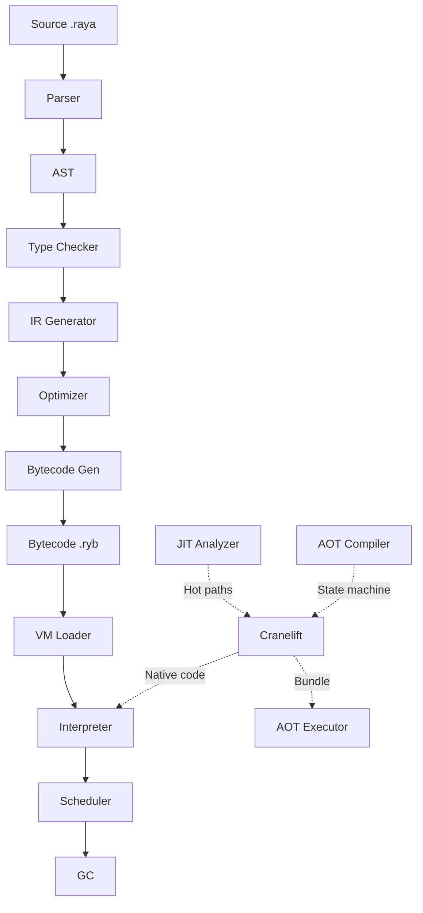

# Architecture Overview

Raya's architecture is built on a foundation of separation of concerns, with clear boundaries between compilation, runtime, and native extensions.

## High-Level Architecture



## Component Layers

### Layer 1: Frontend (Parser)
- **Lexical analysis** - Token stream generation
- **Syntax analysis** - AST construction
- **Semantic analysis** - Type checking, binding
- **Error reporting** - Rich diagnostics with codespan

### Layer 2: Middle-end (Compiler)
- **IR generation** - Three-address code
- **Monomorphization** - Generic specialization
- **Optimization** - Constant folding, DCE, inlining
- **Module linking** - Dependency resolution

### Layer 3: Backend (Codegen)
- **Bytecode generation** - Typed opcodes
- **Module serialization** - .ryb format
- **Metadata embedding** - Debug info, source maps

### Layer 4: Runtime (VM)
- **Bytecode interpreter** - Unified executor
- **Task scheduler** - Work-stealing, M:N threading
- **Garbage collector** - Mark-sweep with nursery allocators
- **Native dispatch** - FFI to Rust functions

### Layer 5: Extensions (Optional)
- **JIT compiler** - Cranelift backend (feature-gated)
- **AOT compiler** - Native bundle generation (feature-gated)
- **LSP server** - Language Server Protocol support

## Data Flow

### Compilation Pipeline

```
Source (.raya)
    ↓ [Lexer]
Tokens
    ↓ [Parser]
AST (Abstract Syntax Tree)
    ↓ [Binder]
Bound AST (with symbols)
    ↓ [Type Checker]
Typed AST
    ↓ [IR Generator]
IR (Three-address code)
    ↓ [Monomorphizer]
Specialized IR
    ↓ [Optimizer]
Optimized IR
    ↓ [Codegen]
Bytecode Module
    ↓ [Serializer]
.ryb file
```

### Execution Pipeline

```
.ryb file
    ↓ [Deserializer]
Bytecode Module
    ↓ [Loader]
Loaded Module (in VM)
    ↓ [Entry Point]
Main Task
    ↓ [Scheduler]
Work-Stealing Queue
    ↓ [VM Workers]
Bytecode Execution
    ↓ [Native Calls]
Stdlib/POSIX Functions
```

## Key Design Decisions

### 1. Static Typing Throughout
- Types preserved through IR
- Typed opcodes (IADD, FADD, NADD)
- No runtime type tags
- Enables aggressive optimizations

### 2. Monomorphization
- Generics specialized at compile time
- Each instantiation gets separate code
- Similar to Rust/C++, not Java/C#
- Trade-off: larger binaries, faster execution

### 3. Bytecode VM
- Platform-independent
- Easy to debug
- JIT-friendly (hot path detection)
- AOT-friendly (state machine transform)

### 4. Work-Stealing Scheduler
- M:N threading model
- One OS thread per CPU core
- Tasks (green threads) multiplexed
- Non-blocking I/O via separate pool

### 5. Decoupled Native Functions
- `NativeHandler` trait abstraction
- Stdlib separate from engine
- Easy to extend with custom natives
- Clean FFI boundary

## Memory Management

### Heap Layout

```
┌─────────────────────────────────────┐
│          Shared Heap                │
├─────────────────────────────────────┤
│  ┌────────────┐  ┌────────────┐    │
│  │  Object 1  │  │  Object 2  │    │
│  └────────────┘  └────────────┘    │
│                                     │
│  ┌──────────────────────────────┐  │
│  │     Task 1 Nursery (64KB)    │  │
│  └──────────────────────────────┘  │
│                                     │
│  ┌──────────────────────────────┐  │
│  │     Task 2 Nursery (64KB)    │  │
│  └──────────────────────────────┘  │
└─────────────────────────────────────┘
```

### GC Strategy
- **Mark-sweep** for shared heap
- **Nursery allocators** for per-Task short-lived objects
- **Bump allocation** in nurseries (fast)
- **Generational** behavior (most objects die young)

### Stack Management
- **Lazy allocation** - 4KB initial size
- **Growth on demand** - Double when needed
- **Stack pooling** - Reuse completed Task stacks
- **Max 1MB** per Task

## Concurrency Architecture

### Scheduler Components

```
┌─────────────────────────────────────────┐
│         Unified Scheduler               │
├─────────────────────────────────────────┤
│  ┌─────────────────┐  ┌──────────────┐ │
│  │  VM Worker Pool │  │   IO Pool    │ │
│  │  (CPU cores)    │  │  (blocking)  │ │
│  └─────────────────┘  └──────────────┘ │
│           ↓                    ↓        │
│  ┌─────────────────┐  ┌──────────────┐ │
│  │ Work-Stealing   │  │  Blocking    │ │
│  │    Deques       │  │  Operations  │ │
│  └─────────────────┘  └──────────────┘ │
└─────────────────────────────────────────┘
```

### Task Lifecycle

1. **Created** - Task spawned by `async` call
2. **Ready** - Pushed to local work-stealing deque
3. **Running** - Executing on VM worker
4. **Suspended** - Awaiting I/O or other Task
5. **Resumed** - Woken by scheduler, back to Ready
6. **Complete** - Result available, stack pooled

## Module System

### Module Loading

```
raya.toml
    ↓ [Manifest Parser]
Dependencies
    ↓ [Resolver]
.ryb files (local/remote/registry)
    ↓ [Loader]
Loaded Modules
    ↓ [Linker]
Linked Module Graph
    ↓ [Executor]
Program Execution
```

### Dependency Types
- **Local path** - `path = "../lib"`
- **URL/git** - `git = "https://..."`
- **Registry** - `version = "1.0"`

## Extension Points

### 1. Native Functions
Implement `NativeHandler` trait:

```rust
pub trait NativeHandler: Send + Sync {
    fn call(&self, ctx: &NativeContext, id: u16, args: &[NativeValue]) 
        -> NativeCallResult;
}
```

### 2. Custom Opcodes (Internal)
Add to `Opcode` enum and implement in interpreter.

### 3. Optimization Passes
Add to IR optimizer pipeline.

### 4. JIT Backends
Implement `CodegenBackend` trait.

## Performance Characteristics

| Operation | Cost | Notes |
|-----------|------|-------|
| Task creation | ~100ns | Lazy stack allocation |
| Task switch | ~20-50ns | No syscall |
| Function call | ~5-10ns | Direct bytecode |
| Native call | ~50-100ns | FFI overhead |
| GC nursery alloc | ~10ns | Bump pointer |
| GC heap alloc | ~100ns | Mark-sweep |
| JIT compilation | ~10ms | One-time per hot function |

## Comparison to Other Runtimes

| Feature | Raya | Node.js | Go | Python |
|---------|------|---------|-----|--------|
| Type system | Static | Dynamic | Static | Dynamic |
| Concurrency | M:N Tasks | Event loop | M:N Goroutines | GIL threads |
| GC | Mark-sweep + nursery | Generational | Concurrent | Reference counting |
| JIT | Optional | V8 JIT | No | No |
| Native calls | FFI trait | N-API | cgo | ctypes |

## Related

- [Crates](crates.md) - Detailed crate structure
- [Compiler](compiler.md) - Compilation pipeline
- [VM](vm.md) - Virtual machine internals
- [JIT/AOT](jit-aot.md) - Native compilation
